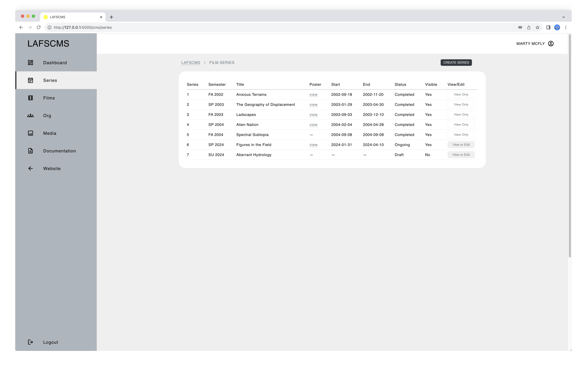
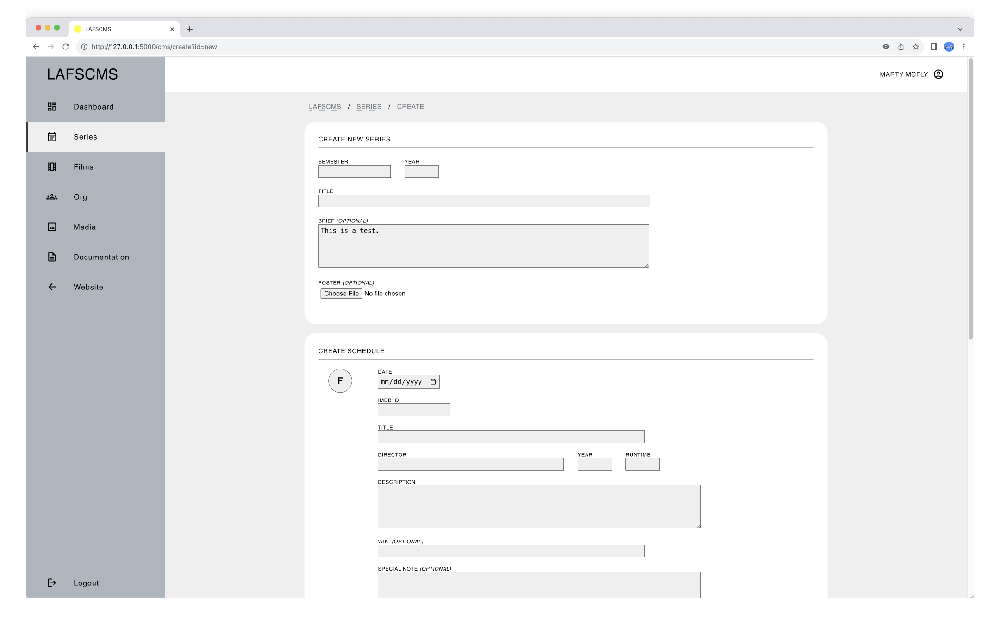
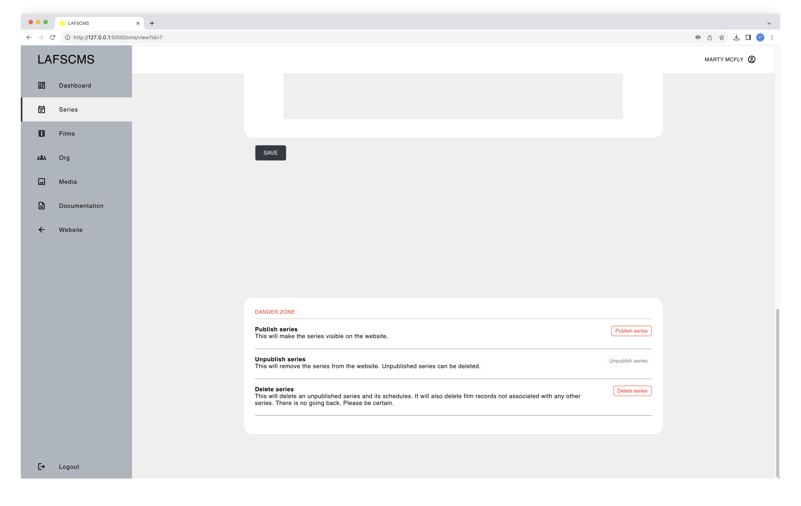
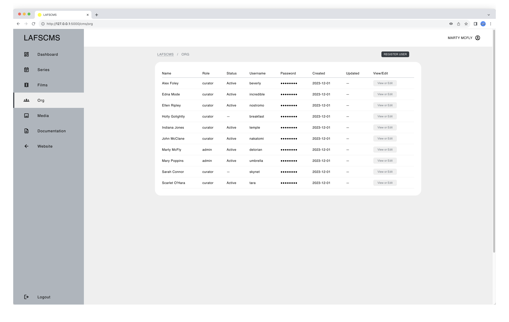

# LAFS-DEV

An early aughts basic website turned modern dev playground for front-end and back-end skill-building

## Table of Contents

> [!NOTE]
> ALL CONTENTS IN THIS REPO ARE FOR EDUCATIONAL PURPOSES ONLY.

* [Description](#description)
* [Target Users](#target-users)
* [Features](#features)
* [Project Structure](#project-structure)
* [Prerequisites](#prerequisites)
* [Getting Started](#getting-started)
  * [Dependencies](#dependencies)
  * [Installation](#installation)
  * [Configuration](#installation)
* [Usage](#usage)
* [System Administration](#system-administration)
* [Author(s)](#authors)
* [Version History](#version-history)
  * [Release Notes](#release-notes)
  * [Initial Release](#initial-release)
* [Future Work](#future-work)
* [License](#license)
* [Contributing](#contributing)
* [Acknowledgments](#acknowledgments)
* [Screenshots](#screenshots)

## Description

In the early aughts, I created a website for the _Landscape Architecture Film Series_, a student-led initiative which I co-founded and co-curated for the [Department of Landscape Architecture](https://landarch.illinois.edu/) at the University of Illinois Urbana/Champaign.

Now some odd years later, I needed a website to use as a learning vehicle for back-end technical skill-building. But not wanting to spend anytime to ideate and design a new one from scratch, I turned to my old website. Its look and feel has aged well, I think, and indeed looks remarkably contemporary. For instance, if the current version of MoMA's film series [website](https://www.moma.org/calendar/film/) is anything to go by, bold color blocking isn't a dated design choice. In other words, I could focus on the back-end and spend little or no time on the front-end.

Tossed into this development playground, it has so far borne out the following:

* [**_LAFS_**](https://github.com/ggeerraarrdd/lafs)

  A GitHub repository serving as the digital coding archive of the website, transformed as a dynamic web application.

  What would otherwise exist as slowly disintegrating bits on a forgotten CD in a remote storage facility or as [fragmented snapshots](https://web.archive.org/web/20040827234527/http://www.rehearsal.uiuc.edu/projects/filmseries/) somewhere in the depths of the Internet Archive has been meticulously restored and recreated.

  No longer basic or static—but a dynamic web application with modern tooling such as Python, Flask, and SQLite. It even has a data model to speak of. It’s interesting to note that the original website predated almost all of the technology used.

* [**l-a-f-s.org**](https://l-a-f-s.org)

  _LAFS_ but live online!

* [**_LAFSCMS_**](https://github.com/ggeerraarrdd/lafs-dev)

  A companion Content Management System (CMS) for the web application (this repository; separate repo coming soon).

  Just like any real-world organization, student-run organizations such as a film series experience knowledge loss when their members graduate. Without a knowledge transfer process, this loss can lead to technical resources being underutilized or becoming inactive. While alternative resources and processes may exist, they either need to be created from scratch, requiring significant time and resources, or are imperfect substitutes. If existing resources work perfectly fine, why go through all that effort?

  LAFSCMS, then, was conceived as a solution to the problem of knowledge loss by providing a platform to manage content and users efficiently with a user-friendly web interface.

What else might be concocted out from a decades-old website? Stay tuned!


## Target Users

* TBD

## Features

* TBD

## Project Structure

```txt
lafs-dev/
│
├── app/
│   │
│   ├── blueprints/
│   │   │
│   │   ├── cms/
│   │   │    ├── __init__.py
│   │   │    ├── routes.py
│   │   │    ├── static/
│   │   │    └── templates/
│   │   │
│   │   └── main/
│   │       ├── __init__.py
│   │       ├── routes.py
│   │       ├── static/
│   │       └── templates/
│   │
│   ├── config/
│   │   └── __init__.py
│   │
│   ├── crud/
│   │   └── __init__.py
│   │
│   ├── data/
│   │   └── lafs.db
│   │
│   ├── infra/
│   │   └── __init__.py
│   │
│   ├── utils/
│   │   └── __init__.py
│   │
│   └── app.py
│
├── logs/
│
├── docs/
├── .gitignore
├── LICENSE
├── README.md
└── requirements.txt
```

## Prerequisites

* TBD

## Getting Started

### Dependencies

* See `requirements.txt`

### Installation

1. **Clone the repository**

    ```bash
    git clone https://github.com/ggeerraarrdd/lafs-dev.git
    ```

2. **Set up a Python virtual environment**

    ```bash
    python3 -m venv venv
    source venv/bin/activate  # On Windows use `venv\Scripts\activate`
    ```

3. **Install the dependencies**

    ```bash
    pip install --upgrade pip
    pip install -r requirements.txt
    ```

### Configuration

1. **Create an `.env` file**

    Place the file in the root directory and add the following as default:

    ```python
    # Database Path
    DATABASE_NAME='data/lafs.db'

    # Database Connection Pool
    POOL_SIZE=5
    MAX_OVERFLOW=10
    POOL_TIMEOUT=30
    POOL_RECYCLE=-1
    ECHO=False

    # Database Retry Settings
    MAX_RETRIES=3
    BASE_DELAY=1
    MAX_DELAY=10

    # Flask Secret Key
    SECRET_KEY='your_flask_secret_key'

    # Google Maps API Key
    MAP_API_KEY='your_map_api_key'
    ```

2. **Database**

    ```python
    # Database Path
    DATABASE_NAME='data/lafs.db'  # Path to SQLite database file

    # Database Connection Pool
    POOL_SIZE=15   # Max number of persistent connections
    MAX_OVERFLOW=5  # Max number of connections above POOL_SIZE
    POOL_TIMEOUT=30  # Seconds to wait for available connection
    POOL_RECYCLE=1800  # Seconds before connection is recycled
    ECHO=False  # Enable SQLAlchemy engine logging

    # Database Retry Settings
    MAX_RETRIES=3  #  Max retry attempts for failed operations
    BASE_DELAY=1  # Initial delay between retries in seconds
    MAX_DELAY=10  # Max delay between retries in seconds
    ```

3. **Flask Secret Key**

    ```python
    # Flask Secret Key
    SECRET_KEY='your_flask_secret_key'
    ```

4. **Google Maps API Key**

    ```python
    # Google Maps API Key
    MAP_API_KEY='your_map_api_key'
    ```

    An API Key is needed for the embedded map to work. Before you can create one, you will need to create a Google Cloud project, for which you need a Google Cloud account.

    * [Set up a Google Cloud account](https://cloud.google.com)
    * [Set up your Google Cloud project](https://developers.google.com/maps/documentation/javascript/cloud-setup)
    * [Using API Keys](https://developers.google.com/maps/documentation/javascript/get-api-key)

## Usage

1. **Go into the app directory and run the command**

    ```bash
    flask run
    ```

2. **Open the film series website**

    Copy and open the URL displayed after 'Running on' in the terminal.

3. **Access the CMS**

    Add `/cms` at the end of the URL.

## System Administration

* TBD

## Author(s)

* [@ggeerraarrdd](https://github.com/ggeerraarrdd/)

## Version History

### Release Notes

* See [https://github.com/ggeerraarrdd/lafs-cms/releases](https://github.com/ggeerraarrdd/lafs-cms/releases)

### Initial Release

* TBD

## Future Work

* TBD

## License

* [MIT License](https://github.com/ggeerraarrdd/large-parks/blob/main/LICENSE)

## Contributing

* TBD

## Acknowledgments

* Coeus

## Screenshots









## Frontispiece

* TBD
