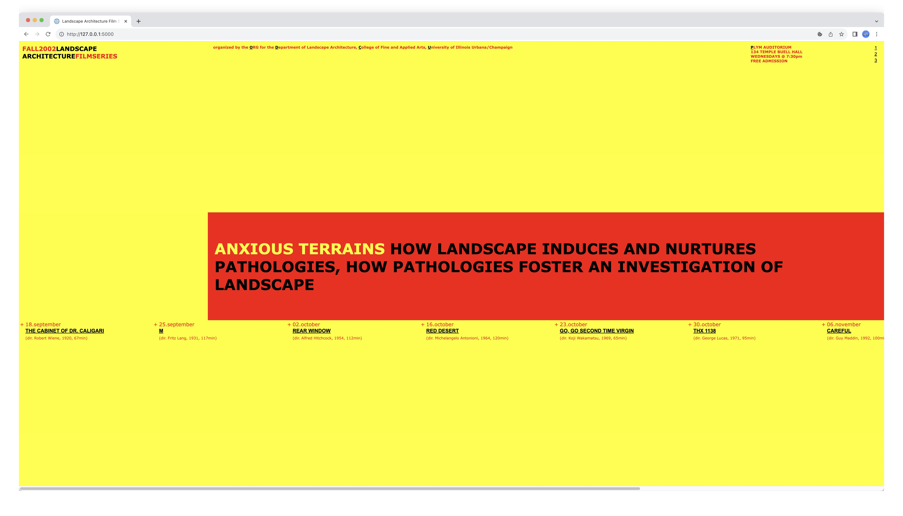
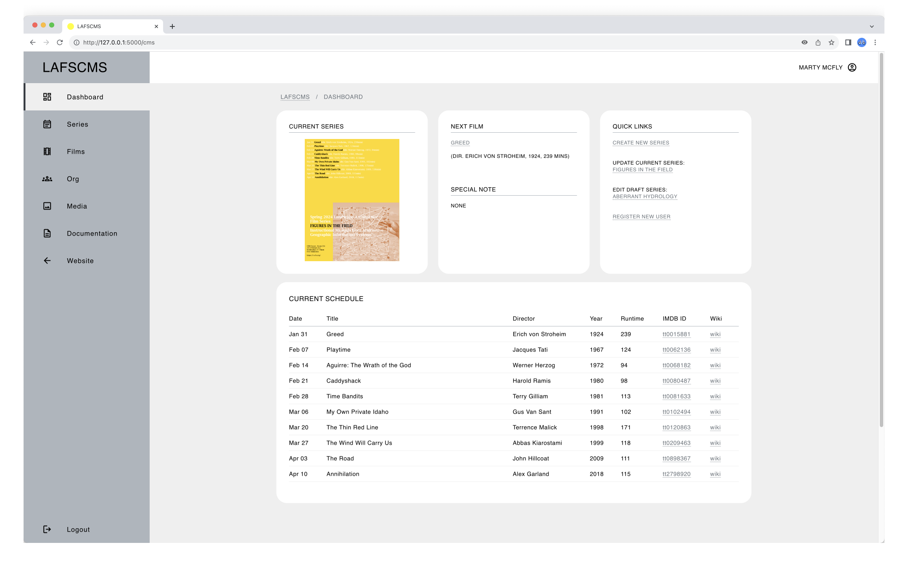

# LAFS-DEV

An early aughts website turned modern dev playground for full-stack, DevOps and system architecture skill-building

## Table of Contents

> [!NOTE]
> ALL CONTENTS IN THIS REPO ARE FOR EDUCATIONAL PURPOSES ONLY.

* [Description](#description)
* [Target Users](#target-users)
* [Features](#features)
* [Project Structure](#project-structure)
* [Quick Start](#quick-start)
* [Local Setup](#local-setup)
  * [Prerequisites](#prerequisites)
  * [Dependencies](#dependencies)
  * [Installation](#installation)
  * [Configuration](#installation)
* [Usage](#usage)
* [Production Setup](#production-setup)
* [System Administration](#system-administration)
* [Author(s)](#authors)
* [Version History](#version-history)
  * [Release Notes](#release-notes)
  * [Initial Release](#initial-release)
* [Future Work](#future-work)
* [License](#license)
* [Contributing](#contributing)
* [Acknowledgments](#acknowledgments)
* [Screenshots](#screenshots)

## Description

In the early aughts, I created a website for the _Landscape Architecture Film Series_, a student-led initiative which I co-founded and co-curated for the [Department of Landscape Architecture](https://landarch.illinois.edu/) at the University of Illinois Urbana-Champaign.

Now some odd years later, I needed a website to use as a learning vehicle for technical skill-building. But not wanting to spend anytime to ideate and design a new one from scratch, I turned to my [old website](https://web.archive.org/web/20040827234527/http://www.rehearsal.uiuc.edu/projects/filmseries/). Its look and feel has aged well, I think, and indeed looks remarkably contemporary. For instance, if the current version of MoMA's film series [website](https://www.moma.org/calendar/film/) is anything to go by, bold color blocking isn't a dated design choice. In other words, I could focus on the back end and spend little or no time on the front end.

Tossed into this development playground, it has so far borne out the following:

* [**_LAFS_**](https://github.com/ggeerraarrdd/lafs)

  A GitHub repository serving as the digital coding archive of the website, transformed into a dynamic web application.

  What would otherwise exist as slowly disintegrating bits on a forgotten CD in a remote storage facility or as [fragmented snapshots](https://web.archive.org/web/20040827234527/http://www.rehearsal.uiuc.edu/projects/filmseries/) somewhere in the depths of the Internet Archive has been meticulously restored and recreated.

  All the content, design elements and information architecture are as they were. But it's no longer a static website—it's now a dynamic web application with modern tooling such as Python, Flask and SQLite. It even has a data model to speak of. What's particularly interesting to note here is that the original website predated almost all of the technology used.

* [**l-a-f-s.org**](https://l-a-f-s.org)

  _LAFS_ but live online!

* [**_LAFS-CMS_**](https://github.com/ggeerraarrdd/lafs-cms)

  A bespoke Content Management System (CMS) for the website.

  Just like any organization in the real world, student-run organizations such as a film series experience [organizational knowledge loss (KLT)](https://www.emerald.com/insight/content/doi/10.1108/tlo-09-2022-0108/full/html) when their members graduate. Without a knowledge transfer process, this loss can lead to technical resources being underutilized or becoming inactive. While alternative resources and processes may exist, they either need to be created from scratch, requiring significant time and resources, or are imperfect substitutes. If existing resources work perfectly fine, why go through all that effort?

  _LAFS-CMS_, then, was conceived as an Information System solution for mitigating KLT by simplifying content management. With its user-friendly web interface and automated workflows, it aims to significantly lower technical barriers, enabling all members—regardless of technical expertise—to easily curate public-facing content and internal administrative resources.

What else might be concocted out from a decades-old website? Stay tuned!


> [!NOTE]
> The following sections are for the overall _LAFS-DEV_ project. For information specific to individual _LAFS-DEV_ projects, check out their respective repositories.

## Target Users

_LAFS-DEV_ is intended for:

* **Self-guided learners** on a similar skill-building path towards full-stack, DevOps and system architecture proficiency.
* **Technology educators** looking for a demonstration project with pedagogical value.
* **Potential employers or recruiters** reviewing portfolio work.

## Features

* 🗄️ **Demonstration Project Collection** - Collection of reference implementations for different tech stacks
* 🌱 **Learning Pathways** - Progression from basic concepts to advanced implementations with cross-disciplinary exposure to different layers of application architecture
* 📚 **Educational Resources** - Well-commented code for learning purposes plus version control history showing development evolution

## Project Structure

```text
lafs-dev/
|
├─── lafs/
├─── l-a-f-s.org
├─── lafs-cms/
|
└─── stay_tuned.txt
```

## Quick Start

* NA

## Local Setup

### Prerequisites

While technical affinity is beneficial, the true prerequisites for _LAFS-DEV_ are:

* An inclination to tinker, experiment and venture into new territories
* A thick skin for failures and the ability to view them as valuable learning opportunities
* A capacity to inject fun into oftentimes difficult challenges
* A sense of adventure for the long road ahead

### Dependencies

* NA

### Installation

* NA

### Configuration

* NA

## Usage

* NA

## Production Setup

* NA

## System Administration

* NA

## Author(s)

* [@ggeerraarrdd](https://github.com/ggeerraarrdd/)

## Version History

### Release Notes

* See [https://github.com/ggeerraarrdd/lafs-dev/releases](https://github.com/ggeerraarrdd/lafs-dev/releases)

### Initial Release

* NA

## Future Work

* _LAFS-AWS_
* _LAFS-DB_
* _LAFS-DOC_

## License

* [MIT License](https://github.com/ggeerraarrdd/large-parks/blob/main/LICENSE)

## Contributing

* This project is not accepting contributions at this time. It is intended solely for personal learning and exploration. However, feel free to clone the repository and use it as a learning resource.

## Acknowledgments

* Coeus

## Screenshots




## Frontispiece

Utagawa, Kunisada. (1858). Craftsman (Ko) [Woodblock print triptych]. From the series The Four Classes (Shinokosho). Published by Daikokuya Heikichi (Shojudo).
