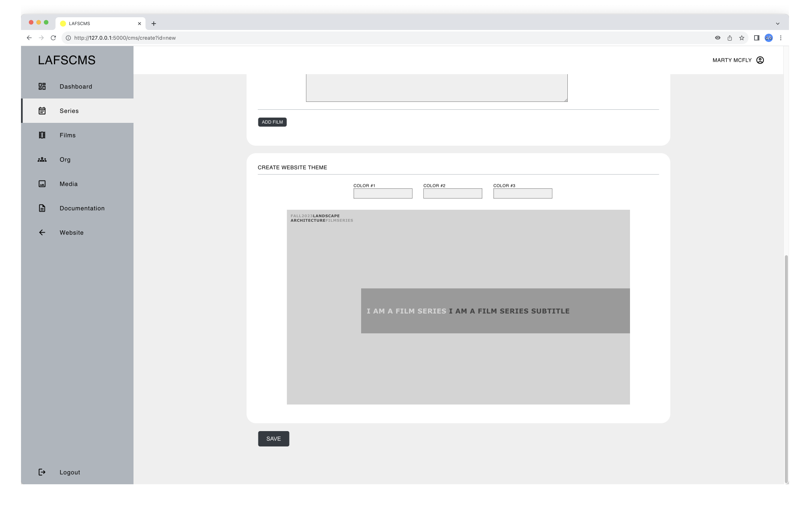
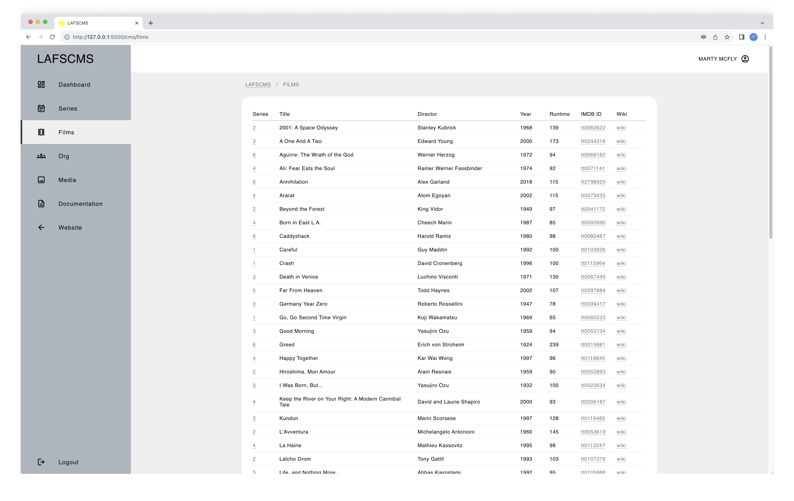

# LAFSCMS

A bespoke CMS for the Landscape Architecture Film Series website

## Description

> [!NOTE]
> ALL CONTENTS IN THIS REPO ARE FOR EDUCATIONAL PURPOSES ONLY.

_LAFSCMS_ is the companion Content Management System (CMS) for the _Landscape Architecture Film Series_ [website](https://l-a-f-s.org/). Currently in alpha, the plan is to merge the beta version with the [film series repo](https://github.com/ggeerraarrdd/film-series).

Just like any real-world organization, student-run organizations such as a film series experience knowledge loss when their members graduate. Without a knowledge transfer process, this loss can lead to technical resources being underutilized or becoming inactive. While alternative resources and processes may exist, they either need to be created from scratch, requiring significant time and resources, or are imperfect substitutes. If existing resources work perfectly fine, why go through all that effort?

_LAFSCMS_ was developed to address this issue of knowledge loss by providing a CMS with a user-friendly web interface to manage content and users efficiently.


More screenshots below.

## Table of Contents

* [Description](#description)
* [Features](#features)
* [Project Structure](#project-structure)
* [Prerequisites](#prerequisites)
* [Getting Started](#getting-started)
  * [Dependencies](#dependencies)
  * [Installation](#installation)
  * [Configuration](#installation)
  * [Usage](#usage)
* [Author(s)](#authors)
* [Version History](#version-history)
  * [Release Notes](#release-notes)
  * [Initial Release](#initial-release)
* [Future Work](#future-work)
* [License](#license)
* [Contributing](#contributing)
* [Acknowledgments](#acknowledgments)
* [Screenshots](#screenshots)

## Features

* Content Management
  * Complete film series lifecycle handling (Create, Edit, Publish, Unpublish)
  * Flexible schedule management tools
  * Integrated media asset handling

* Security
  * Secure authentication with role-based controls (Admin and Curator roles)
  * Basic user privilege management
  * Baseline database security implementation

* Database Features
  * Historical data preservation
  * Searchable archive

* Interface
  * Instant content synchronization
  * Multi-user collaboration support

## Project Structure

```txt
lafs-cms/
│
├── app/
│   │
│   ├── blueprints/
│   │   │
│   │   ├── cms/
│   │   │   ├── __init__.py
│   │   │   ├── routes.py
│   │   │   ├── static/
│   │   │   └── templates/
│   │   │
│   │   └── main/
│   │       ├── __init__.py
│   │       ├── routes.py
│   │       ├── static/
│   │       └── templates/
│   │
│   ├── config/
│   │   └── __init__.py
│   │
│   ├── crud/
│   │   └── __init__.py
│   │
│   ├── data/
│   │   └── lafs.db
│   │
│   ├── helpers/
│   │   └── __init__.py
│   │
│   └── app.py
│
├── docs/
├── .gitignore
├── LICENSE
├── README.md
└── requirements.txt
```

## Prerequisites

* TBD

## Getting Started

### Dependencies

* See `requirements.txt`

### Installation

1. **Clone the repository:**

    ```bash
    git clone https://github.com/ggeerraarrdd/lafs-cms.git
    ```

2. **Navigate into the project directory:**

    ```bash
    cd lafs-cms # For example
    ```

3. **Create and activate a virtual environment:**

    ```bash
    python -m venv venv
    source venv/bin/activate  # On Windows use `venv\Scripts\activate`
    ```

4. **Install the dependencies:**

    ```bash
    pip install -r requirements.txt
    ```

5. **Create an `.env` file and set the environment variables:**

    Create a file named `.env` in the `app` directory of the project and add the following variables:

    ```properties
    SECRET_KEY=your_secret_key
    MAP_API_KEY=your_map_api_key
    DATABASE_NAME="lafs.db"
    ```

    Replace `your_secret_key` (see #6 below) and `your_map_api_key` (see # 7 below) with your actual secret key and API key.

6. **Notes on Flask Secret Keys:**

    * TBD

7. **Notes on Google Maps API Keys:**

    * TBD

### Configuration

* TBD

### Usage

1. **Go into the app directory and run the command:**

    ```bash
    flask run
    ```

2. **Open the film series website:**

    Copy and open the URL displayed after 'Running on' in the terminal.

3. **Access the CMS:**

    Add `/cms` at the end of the URL.

## Author(s)

* [@ggeerraarrdd](https://github.com/ggeerraarrdd/)

## Version History

### Release Notes

* See [https://github.com/ggeerraarrdd/lafs-cms/releases](https://github.com/ggeerraarrdd/lafs-cms/releases)

### Initial Release

* TBD

## Future Work

Development of core features is ongoing.

## License

* [MIT License](https://github.com/ggeerraarrdd/large-parks/blob/main/LICENSE)

## Contributing

* TBD

## Acknowledgments

* Notion AI

## Screenshots







## Frontispiece

* TBD
